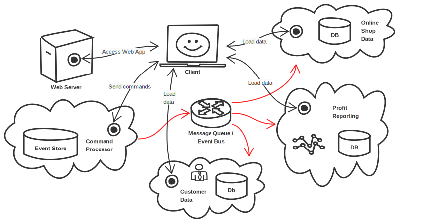
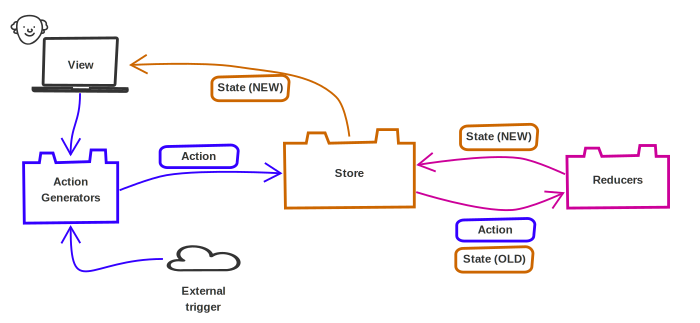
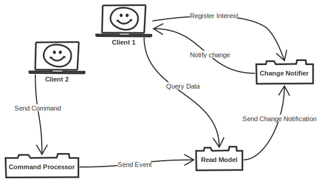

title: Build Your Own Application System From Scratch
subtitle: Fullstack FTW
class: animation-fade
layout: true

<!-- This slide will serve as the base layout for all your slides -->

.bottom-bar[
{{title}}
]

---

class: impact

# {{title}}

## {{subtitle}}

.title-oli[
Oliver Sturm &bull; @olivers &bull; oliver@oliversturm.com
]

.title-logo[]

---

## Oliver Sturm

- Training Director at DevExpress
- Consultant, trainer, author, software architect and developer for over 25 years

- Contact: oliver@oliversturm.com

---

## The Plan

- Create an application system with lots of modern architectural components

  - CQRS/Event Sourcing backend
  - React frontend
  - Cool bidirectional communications

- To fully understand the wheel, it may be necessary to reinvent it

---

## CQRS / Event Sourcing

- CQRS: Command Query Responsibility Segregation
  - Separate execution paths and data models for commands and queries
- Event Sourcing: Derive all application system state from a central log of events

---

## CQRS / Event Sourcing

.svg-light[]

---

class: impact

# DEMO

Let's jump in at the deep end...

---

## Block 1 Workshop - CQRS/ES

Try everything you saw for yourself! A practice task is included at the end of the instructions you find with the starting point project.

- Starting point project: https://osturm.me/odfs-1-start
- End point project: https://osturm.me/odfs-1-end

---

## Block 2 Workshop - React

Try everything you saw for yourself! A practice task is included at the end of the instructions you find with the starting point project.

- Starting point project: https://osturm.me/odfs-2-start
- End point project: https://osturm.me/odfs-2-end

---

## React - The Missing Parts

- Redux
- Routing
- Interacting with the backend
- Edit form handling

---

### Redux

.svg-light[]

---

class: impact

# DEMO

---

## Block 3 Workshop - React Infrastructure

Try everything you saw for yourself! A practice task is included at the end of the instructions you find with the starting point project.

- Starting point project: https://osturm.me/odfs-3-start
- End point project: https://osturm.me/odfs-3-end

---

## socket.io

- Bidirectional communication between server and clients
- Flexible transport system -- works everywhere
- Message passing semantics

---

## Change Notifier Service

.svg-light[]

---

class: impact

# DEMO

---

## Block 4 Workshop - Change Notifications

Try everything you saw for yourself! A practice task is included at the end of the instructions you find with the starting point project.

- Starting point project: https://osturm.me/odfs-4-start
- End point project: https://osturm.me/odfs-4-end

---

## Sources

- This presentation:

  - https://oliversturm.github.io/one-day-fullstack-complete
  - PDF download:  https://oliversturm.github.io/one-day-fullstack-complete/slides.pdf

- Source code: https://github.com/oliversturm/one-day-fullstack-complete

---

class: impact

# Thank You

Please feel free to contact me about the content anytime.

.title-oli[
Oliver Sturm &bull; @olivers &bull; oliver@oliversturm.com
]

.title-logo[

]
